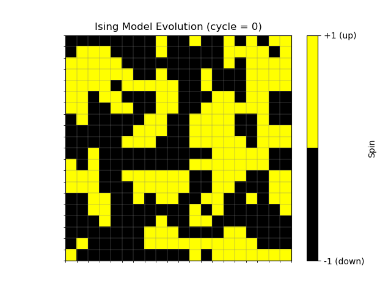
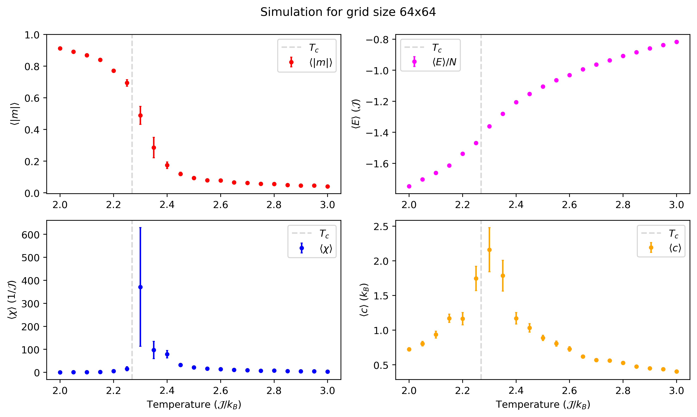
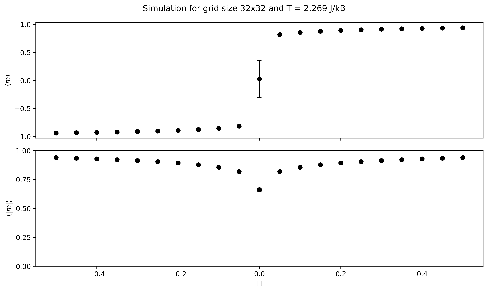

# TU Delft Computational Physics Project 2: Monte Carlo simulation of the 2D Ising Model
## Authors: Kyproula Mitsidi, Konstantinos Pourgourides

Welcome to our Monte Carlo simulation of the 2D Ising Model! Our project simulates the evolution of a square spin lattice, shaped iteratively through spin interactions, thermal fluctuations and the infuence of an external magnetic - leading to interesting physics such as critical fluctuations and a second order phase transition! Here, you can learn how to run the simulation yourself using the file `ising_model_testing.ipynb`. All the in-depth details about the structure of the simulation and some cool numerical results can be found in our [report](https://gitlab.kwant-project.org/computational_physics/projects/Project2-Ising_kmitsidi_kpourgourides/-/blob/fee5ee66a36eff3a75f4d304a977819b51e5effb/report/report.pdf).

<p align="center">
  
</p>

### Load the necessary modules

Run this cell to load the necessary modules

```
import ising_model as ismo
import observables as obs
from IPython.display import display, Math
``` 

### Visualization

#### Physical Observables vs Temperature

You can visualize physical observables vs temperature - namely, magnetization, energy, susceptibility per spin and specific heat per spin. To do so, run the following cell!

```
temperature_grid, magnetization, susceptibility, specific_heat, energy = obs.get_obs_vs_temperature(
    cycles = 17000, 
    L = 32, 
    B = 0, 
    T_init = 2, 
    T_final = 3.1, 
    step = 0.1)
obs.plot_obs_vs_temperature(temperature_grid, magnetization, susceptibility, specific_heat, energy)
```

<p align="center">
  
</p>

The arguments correspond to:
`cycles`: Total MC cycles for the simulation
`L`: Dimension of the spin lattice
`B`: External magnetic field
`T_init`/`T_final`/`step`: Initial and final value of temperature to plot over, and the increment size between them


#### Magnetization vs Temperature

You can visualize the proper and absolute magnetization vs magnetic field. To do so, run the following cell!

```
field_grid, absmag, absmag_err, mag, mag_err = obs.get_magnetization_vs_field(
    cycles = 17000, 
    L = 32, 
    T = 2.269, 
    B_init = -0.5,
    B_final = 0.6, 
    step = 0.1)
obs.plot_magnetization_vs_field(field_grid, absmag, absmag_err, mag, mag_err)
```

<p align="center">
  
</p>

The arguments correspond to:
`cycles`: Total MC cycles for the simulation
`L`: Dimension of the spin lattice
`T`: Temperature
`B_init`/`B_final`/`step`: Initial and final value of magnetic field to plot over, and the increment size between them

> [!NOTE]
> The pre-set values for the arguments are recommended by us to produce visually pleasing results. You can also choose your own parameters!

### The end
You have reached the end, thank you for following this guide on how to run our simulation!