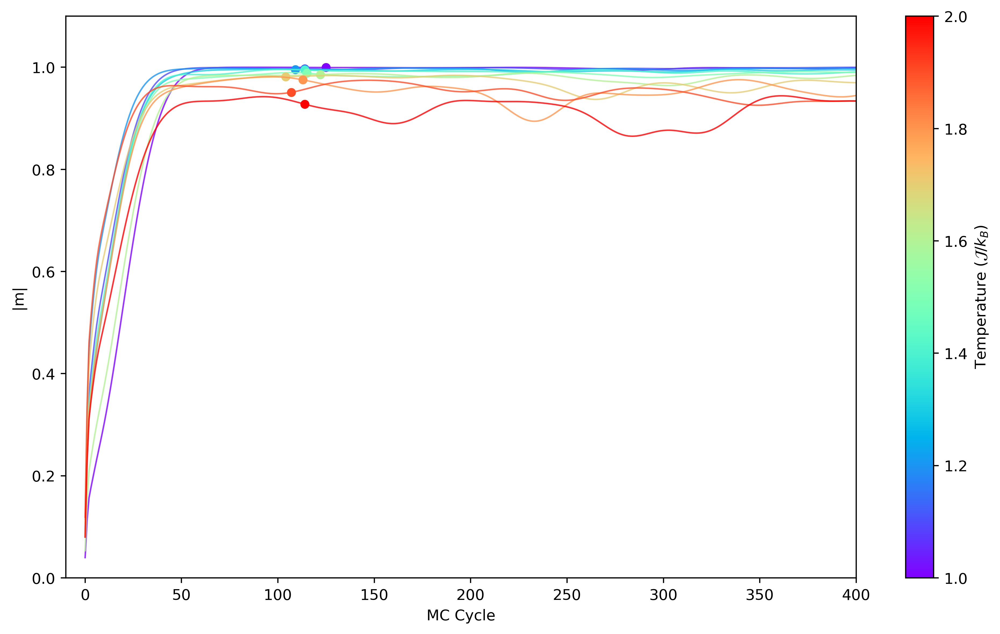
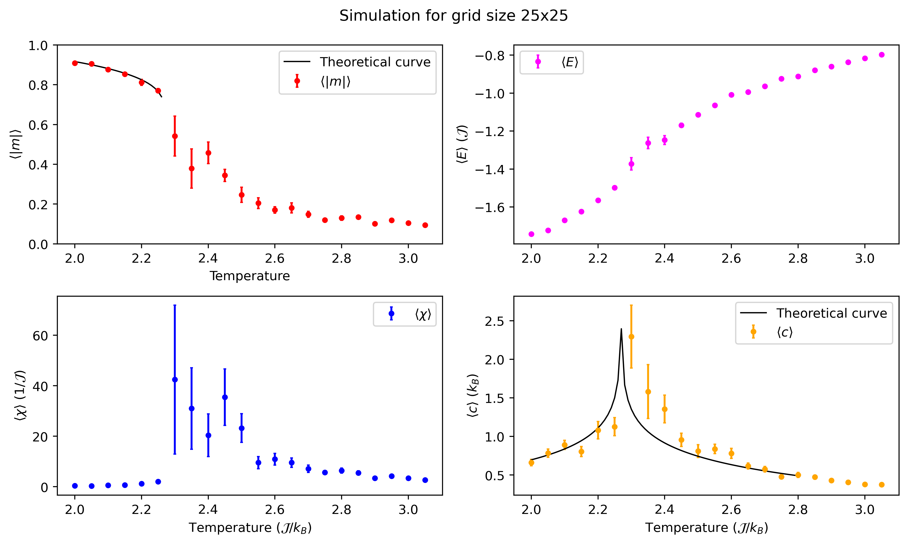
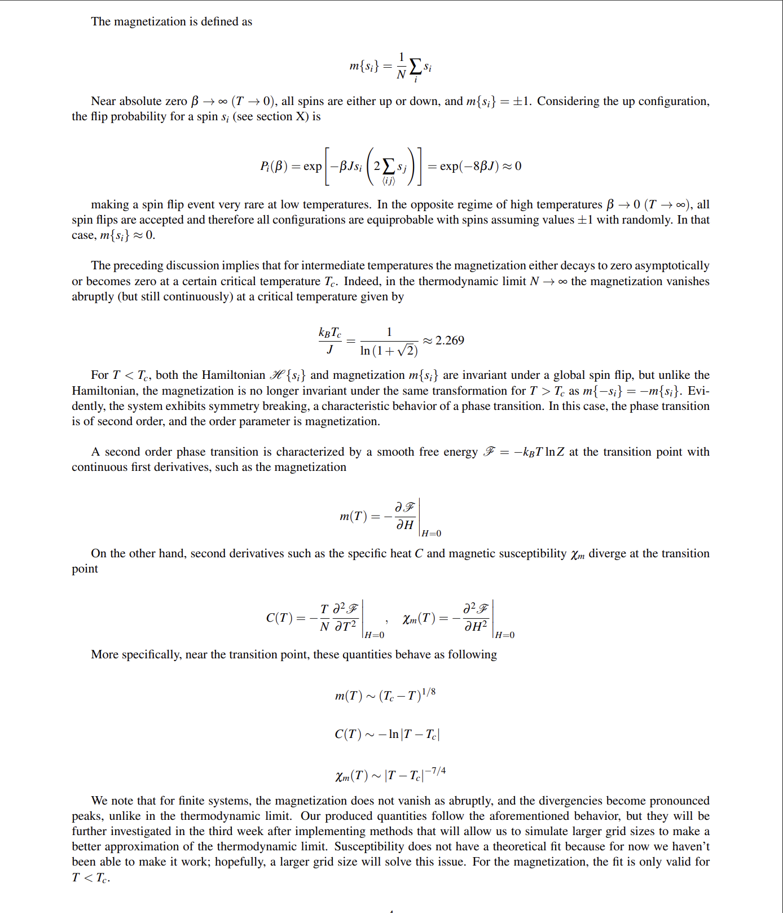
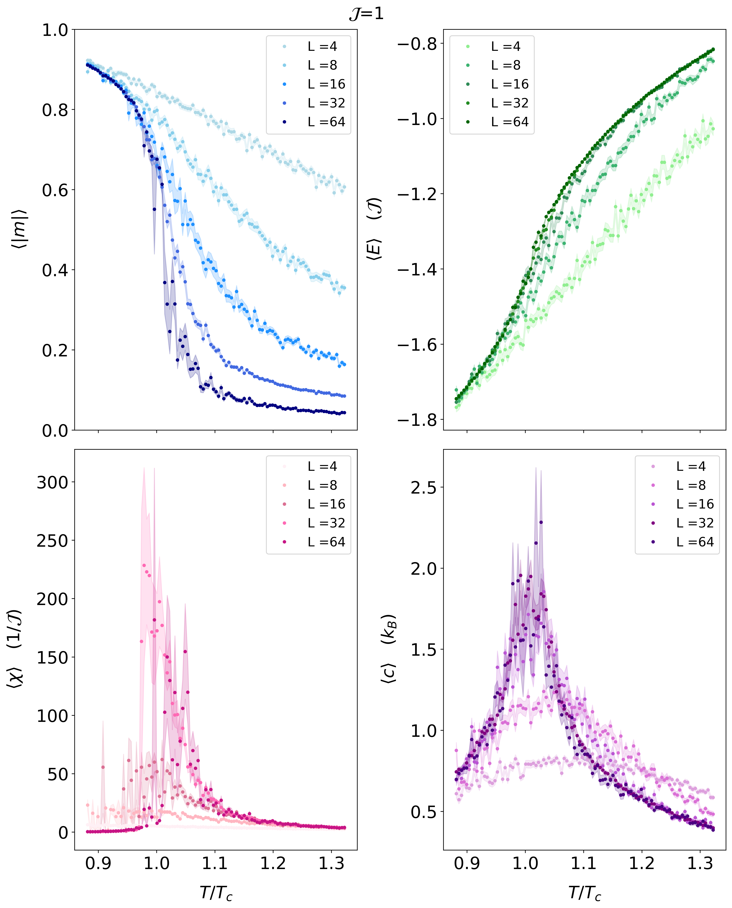
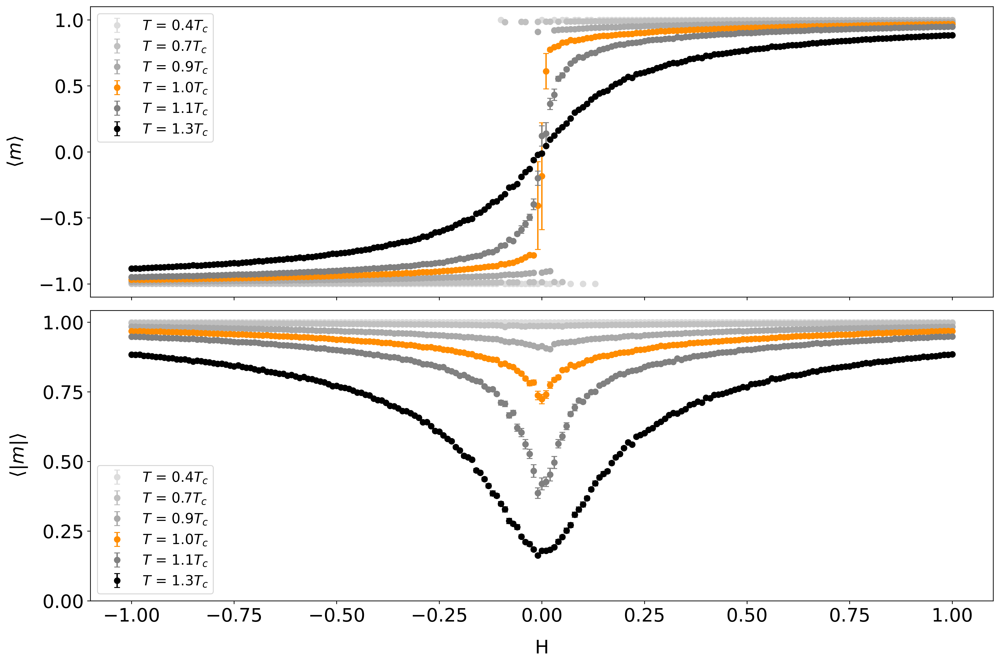

# Weekly progress journal

## Instructions

In this journal you will document your progress of the project, making use of the weekly milestones.

Every week you should

1. write down **on the day of the lecture** a short plan (bullet list is sufficient) of how you want to
   reach the weekly milestones. Think about how to distribute work in the group,
   what pieces of code functionality need to be implemented.
2. write about your progress **until Monday, 23:59** before the next lecture with respect to the milestones.
   Substantiate your progress with links to code, pictures or test results. Reflect on the
   relation to your original plan.

We will give feedback on your progress on Tuesday before the following lecture. Consult the
[grading scheme](https://computationalphysics.quantumtinkerer.tudelft.nl/proj1-moldyn-grading/)
for details how the journal enters your grade.

Note that the file format of the journal is *markdown*. This is a flexible and easy method of
converting text to HTML.
Documentation of the syntax of markdown can be found
[here](https://docs.gitlab.com/ee/user/markdown.html#gfm-extends-standard-markdown).
You will find how to include [links](https://docs.gitlab.com/ee/user/markdown.html#links) and
[images](https://docs.gitlab.com/ee/user/markdown.html#images) particularly.

## Week 1
(due Monday, 20 April 2026, 23:59)

#### Planning

##### Code Functionality / Milestones

- [ ] **Initialize grid for 2D ising model:**

We will initialize an array with shape $N=L^2$  corresponding to the spin values of the 2D grid we want to simulate.

- [ ] **Create an iterative process for flipping spins randomly:**

In each iteration we will randomly flip a spin, and then calculate the energy difference between the current and previous configuration. The energy difference depends only on the chosen spin and its nearest neighbours. The flip is accepted or rejected by Metropolis algorithm.

- [ ] **Implement periodic boundary conditions:**

We impose periodic boundary conditions, so spins on opposite edges of the grid interact with each other, i.e. spin with coordinates (i, L) interacts with (i, 0), and spin with coordinates (L, i) interacts with (0, i), for all values of i.

- [ ] **Implement Metropolis algorithm to decide if new configuration is accepted or not:**

For each proposed spin flip we investigate whether the energy difference $\Delta E$ is negative or positive. For a negative energy difference, the flip is always accepted, otherwise the flip is accepted with probability $e^{-\beta \Delta E}$.

- [ ] **Investigate whether our approach fulfills detailed balance**:

We will analyse the way our algorithm works to determine whether detailed balance is fulfilled.
      

- [ ] **Make plans on how to validate our code in the following weeks.**

We aim to calculate the energy and magnetization of our configrations. This way we will be able to determine the equilibrium step, and start calculating the observables from that point onward. Having accurate measurements of our observables will help us determine whether our code functions properly.

#### Progress

- [X] **Initialize grid for 2D ising model:**
      
We created an $L \times L$ grid of area $N$ corresponding to the number of spins in the system. The initialization of the grid can be chosen to be in one of three available setttings: 

- `aligned`: all spins are initially up (+1), 
- `random`: the spin grid is initialized randomly
- `custom`: the users can input their own custom grid

> [!IMPORTANT]
> See the initialization of the spin grid [here](https://gitlab.kwant-project.org/computational_physics/projects/Project2-Ising_kmitsidi_kpourgourides/-/blob/12afad207d4b6ea3a8a677648ac13df1e0bba302/ising_model.py#L156-166).

- [X] **Create an iterative process for flipping spins randomly:**
      
We create a loop that lasts for a certain number of Monte Carlo (MC) Cycles (decided by the user). One MC (Monte Carlo) cycle consists of $N=L^2$ iterations. At each iteration, we randomly pick two indices corresponding to the coordinates of a spin on the 2D lattice. Next, we decide whether to flip the chosen spin or not by using the Metropilis algorithm. 

> [!IMPORTANT]
> See the iterative process and randomized selection of the spin [here](https://gitlab.kwant-project.org/computational_physics/projects/Project2-Ising_kmitsidi_kpourgourides/-/blob/12afad207d4b6ea3a8a677648ac13df1e0bba302/ising_model.py#L177-182).

- [X] **Implement periodic boundary conditions:**

The decision of whether the spin will flip or not depends on its interactions with its nearest neighbors. Some of the nearest neighbors for spins located on the edges of the grid are on opposite sites. Thus, we want to impose periodic boundary conditions to capture these interactions correctly. These conditions are implemented in the sum of the nearest-neighbour spins of the randomly chosen grid point. 

> [!IMPORTANT]
> See the implementation of the periodic BCs [here](https://gitlab.kwant-project.org/computational_physics/projects/Project2-Ising_kmitsidi_kpourgourides/-/blob/12afad207d4b6ea3a8a677648ac13df1e0bba302/ising_model.py#L24-30).

- [X] **Implement Metropolis algorithm to decide if new configuration is accepted or not:**

In the Metropolis algorithm, a spin flip that causes an energy difference $\Delta H$ is always accepted if the $\Delta H < 0$, otherwise it is accepted with probability $e^{-\beta \Delta H}$. Thus, we created a function that calculates $\Delta H$ for each proposed configuration at every iteration, and decides whether the trial move is accepted. 

> [!NOTE]
> Note that our functions are structured in natural units to simplify calculations.

> [!IMPORTANT]
> See the implementation of the Metropolis algorithm [here](https://gitlab.kwant-project.org/computational_physics/projects/Project2-Ising_kmitsidi_kpourgourides/-/blob/12afad207d4b6ea3a8a677648ac13df1e0bba302/ising_model.py#L183-186).

Below you can see the animated evolution of an initially randomized $20\times 20$ spin grid for the first 275 MC cycles at temperature $T = 1.6 \mathcal{J}/k_B$.

     
Evidently, despite the initially random state of the system, the spins become aligned (-1) and the system reaches equilibrium at some point in time. Note that small fluctuations can still be observed without altering the overall state of the system. 

- [X] **Investigate whether our approach fulfills detailed balance**:

The detailed balance is given by:

$$p(R)T(R \rightarrow R^\prime) = p(R^\prime)T(R^\prime \rightarrow R)$$

where $T(R \rightarrow R^\prime)$ is the probability of transitioning from a state $R$ to a state $R^\prime$ and $p(R)$ is the equilibrium probability distribution of state $R$. The probability distribution $p(R)$ is given by the Boltzmann distribution $e^{-\beta E}$ and the transition probability is given by the product of the proposal and acceptance probabilities.

In our code, the acceptance probability is given by $e^{-\beta \Delta E}$ for positive energy differences, while negative energy differences are always accepted. The proposal probability is a uniform distribution, as proposed spins are chosen randomly. The proposal probabilities are symmetric and therefore cancel in the ratio of transition probabilities. 

We can take two states $R$ and  $R^\prime$ of energies $E, E^\prime$ where $E < E^\prime$ such that $\Delta E = E' - E > 0$. The acceptance probability for the transition $R \rightarrow R'$ is $e^{-\beta \Delta E}$, while the reverse transition $R' \rightarrow R$ is always accepted. By subsituting in the detailed balance equation we find:

 $$p(R)/p(R^\prime) = 1/e^{-\beta \Delta E} = e^{\beta \Delta E}$$ 

which is satisfied by the Boltzmann distribution we want to reach. 

Since the Boltzmann distribution is the desired equilibrium distribution, the Metropolis algorithm uses transition probabilities that satisfy detailed balance, ensuring the simulation samples configurations according to the Boltzmann distribution.

- [X] **Make plans on how to validate our code in the following weeks.**

To validate our code, we aim to examine different configurations that include:

- different lattice sizes
- different temperatures, especially the regime near the critical temperature
- different magnetic fields
  
and investigate how different observables behave compared to existing literature, such as susceptibility, specific heat, energy and magnetization. We will also investigate how fast the system reaches equilibrium as a function of different temperatures and lattice sizes so that we can estimate how many initial steps must be discarded when computing observables in our next steps.

So far, we have investigated the equilibrium time ($n_0$) for small lattice sizes $\approx 10 \times 10)$. To find the scale of $n_0$ we ran many simulations for different temperatures for a fixed lattice size and random initial configuration. We defined equilibrium as the point at which the change in absolute magnetization between consecutive MC cycles settled below a chosen threshold. Below, you can see some preliminary results of this analysis, where the equilibrium times are indicated by the colored points:

Evidently, for such small lattice sizes and temperatures below the critical temperature the system reaches equilibrium in $\approx 100-150$ MC cycles. We expect this number to grow with larger lattice sizes and/or near the critical temperatures.

In the following weeks we will implement the numpyfied version of the Metropolis Algorithm, which will allow us to explore simulations with bigger lattice sizes, and we will re-perform this analysis to investigate $n_0$ further.

#### AI disclosure
We used `chatGPT` to help us with the animation commands, and to inform us on useful available tools of different libraries. All implemented ideas are our own.

## Week 2
(due Monday, 27 April 2026, 23:59)

#### Planning

##### Code Functionality / Milestones
- [ ] **Calculate physical quantities:**

We will create new functions that calculate magnetization, specific heat, susceptibility and energy for different temperatures without magnetic field.
      
- [ ] **Implement errors:**

We will implement the autocorralation function and bootstrap method to calculate the errors of the aforementioned quantities.

- [ ] **Compare results to literature:**

We will produce plots of the observables with errors and theory-based fits to make direct comparisons to existing literature.

- [ ] **Organize main simulation and observables in seperate python files:**

We will separate the functions responsible for the evolution of the system and the calculation of observables in different python files for organizational clarity.

- [ ] **Decide on expansion for week 3**

We will decide which of the 3 proposed expansions to follow for week 3, picking the one more suitable for our project and justify our reasoning.

#### Progress

- [X] **Calculate physical quantities:**

We have created a function  for the calculation of each observable (magnetization, specific heat, susceptibility and energy) according to the formulas provided in the lecture notes.
      
> [!IMPORTANT]
> See the function that calculates magnetization [here](https://gitlab.kwant-project.org/computational_physics/projects/Project2-Ising_kmitsidi_kpourgourides/-/blob/52cf1d1df95a999c13f62cd66fd22732ae260adb/observables.py#L81-89), specific heat [here](https://gitlab.kwant-project.org/computational_physics/projects/Project2-Ising_kmitsidi_kpourgourides/-/blob/52cf1d1df95a999c13f62cd66fd22732ae260adb/observables.py#L124-139), susceptibility [here](https://gitlab.kwant-project.org/computational_physics/projects/Project2-Ising_kmitsidi_kpourgourides/-/blob/52cf1d1df95a999c13f62cd66fd22732ae260adb/observables.py#L105-120) and energy [here](https://gitlab.kwant-project.org/computational_physics/projects/Project2-Ising_kmitsidi_kpourgourides/-/blob/52cf1d1df95a999c13f62cd66fd22732ae260adb/observables.py#L91-101).

- [X] **Implement errors:**

We have used the autocorrelation function for the calculation of errors for the magnetization and energy. Furthermore, for susceptibility and specific heat, which include the variance of magnetization and energy respectively, and are more prone to large errors, we used the autocorrelation function to calculate the correlation time $\tau$ and produce uncorrelated samples. Then, we proceeded to calculate the actual errors using the bootstrap method on the uncorrelated data.

> [!IMPORTANT]
> See the autocorrelation function [here](https://gitlab.kwant-project.org/computational_physics/projects/Project2-Ising_kmitsidi_kpourgourides/-/blob/52cf1d1df95a999c13f62cd66fd22732ae260adb/observables.py#L35-78), and the bootstrap method [here](https://gitlab.kwant-project.org/computational_physics/projects/Project2-Ising_kmitsidi_kpourgourides/-/blob/52cf1d1df95a999c13f62cd66fd22732ae260adb/observables.py#L11-31).
      
- [X] **Compare results to literature:**

> [!IMPORTANT]
> We had several issues with rendering some latex commands for this milestone (as can be seen from our commit history), so we upload a screenshot here of our text and equations from overleaf.

Below you can see the produced results for the physical quantities with errors on a 25 $\times$ 25 grid and no magnetic field

     
Our literature source is the *Computational Physics* book by **Jos Thijssen**

- [X] **Organize main simulation and observables in seperate python files:**

We have made the separation which provided more structure and organizational clarity to our code. Main simulation functions are in the module `ising_model.py`, and observable/error related functions are in `observables.py`.

- [X] **Decide on expansion for week 3**

We have decided that in the following week, we will implement the numpified version of the metropolis algorithm as our expansion (instead of studying critical exponents or the Swendsen-Wang/Wolff algorithm). The reason for this is that this expansion will allow us to make our simulation run much more efficiently, needing only two iterations per MC cycle instead of N, which will make a real difference as we work towards larger grids. We expect, according to the theory, that by having a larger grid size (thus approaching the thermodynamic limit), our observables will exhibit a better behavior and the overall simulation will be more accurate and efficient.

Also, this expansion will provide the chance to make insightful comparisons between the standard and numpified metropolis algorithms regarding computational resources and efficiency.

#### AI disclosure

We haven't used AI to reach this week's milestones.

## Week 3
(due Monday, 04 May 2026, 23:59)

#### Planning

##### Code Functionality / Milestones

- [ ] **Implement the numpified Metropolis algorithm as our chosen expansion**

We will implement the numpified version of the Metropolis algorithm, which will improve the efficiency of our simulation and allow us to run further simulations for our physical observables for larger spin grids and more values of the independent variable (e.g. temperature, magnetic field).

> [!NOTE]
> In the previous week, the TA responsible for this project recommended to plan on how we will study critical exponents, even though we mentioned that we will choose another extension (numpified algorithm) instead of critical exponents, as we were given this choice by the instructors [(see here)](https://compphys.quantumtinkerer.tudelft.nl/proj2-intro-ising/#:~:text=implement%20one%20of%20the%20possible%20extensions%20(Swendsen%2DWang/Wolff%20algorithm%2C%20numpified%20Metropolis%20algorithm%2C%20or%20studying%20critical%20exponents.%20You%20may%20also%20choose%20a%20different%20direction%2C%20but%20then%20make%20sure%20to%20discuss%20with%20us)). Are we supposed to do both? Is there something we misunderstood?

- [ ] **Generate results including errorbars**

We have already implemented this step in the previous week (see previous week's milestones). Nevertheless, due to the numpified Metropolis algorithm extension, we will hopefully be able to produce and exhibit more detailed results.

- [ ] **Study magnetization, energy, susceptibility and specific heat as function of temperature for different grid sizes**

We plan to study the aforementioned physical quantities for different grid sizes as function of temperature and see if they agree with last week's results. We expect that as we move towards larger grid sizes the behavior will improve even more.

- [ ] **Study magnetization as a function of magnetic field for fixed temperature**

We plan to study the behavior of absolute and proper magnetization as a function of the magnetic field at $T=T_c$. For absolute magnetization, we expect to see a dip at $H=0$ because of large fluctuations in the system, but for large magnetic fields we expect for this quantity to converge to 1 because of strong alignment of spins due to the external driving. For proper magnetization, we expect +1(-1) values at large fields, and 0 at $H=0$ due to the large fluctuations that cancel out each other.

#### Progress

- [X] **Implement the numpified Metropolis algorithm as our chosen expansion**

We have created a new function which implements the numpified Metropolis algorithm. The idea is that we can imagine our spin grid as a chessboard with black and white sites. All the nearest neighbors of white sites are black and vice versa. Due to this, we can simultaneously attempt the trial move (spin flip) for all black and then all white sites. The Metropolis criterion is then simultaneously checked for all black and white sites simultaneously using numpy arrays; additionally, the accepted trial moves are also implemented simultaneously for all same color sites. This highly improved the efficiency of our simulation, which we will discuss in greater detail in the report.

> [!IMPORTANT]
> You can see the implementation of the numpified Metropolis algorithm [here](https://gitlab.kwant-project.org/computational_physics/projects/Project2-Ising_kmitsidi_kpourgourides/-/blob/35938ed186a31ce0b32de50a7cc926ce2bf1c2ba/ising_model.py#L111-123). The auxiliary function for the simultaneous calculation of all nearest neighbors for all spin grid sites can bee found [here](https://gitlab.kwant-project.org/computational_physics/projects/Project2-Ising_kmitsidi_kpourgourides/-/blob/35938ed186a31ce0b32de50a7cc926ce2bf1c2ba/ising_model.py#L80-86).

- [X] **Generate results including errorbars**

We have already implemented this step in the previous week [(see here)](https://gitlab.kwant-project.org/computational_physics/projects/Project2-Ising_kmitsidi_kpourgourides/-/blob/35938ed186a31ce0b32de50a7cc926ce2bf1c2ba/journal.md#:~:text=energy%20here.-,Implement%20errors%3A,the%20autocorrelation%20function%20here%2C%20and%20the%20bootstrap%20method%20here.,-Compare%20results%20to), but adding it here again for completeness.

- [X] **Study magnetization, energy, susceptibility and specific heat as function of temperature for different grid sizes**

Below you can see the plot of the above physical quantities as functions of temperature for different grid sizes

The results continue to resemble lasts week's result, which agree with the theory explained also in the previous week. The errors appear as bands for visual clarity. It is evident that results gradually move closer to the expected behavior of the thermodynamic limit as the grid size increases.

- [X] **Study magnetization as a function of magnetic field for fixed temperature**

Below you can see the plot of the proper and absolute magnetization as function of magnetic field for $T=T_c$

*Proper Magnetization:* From the Ising Model Hamiltonian, for negative magnetic fields the spins tend to align themselves down (-1), and the opposite (+1) for positive magnetic fields. For zero magnetic field, we expect that large critical fluctuations suppress ordered aligment and lead to vanishing magnetization. Our results are consistent these expectations.

*Absolute Magnetization:* Using the same arguments as before, in the limit of large positive/negative magnetic field, absolute magnetization will always be +1. In the case of zero magnetic field, the absolute magnetization will be **non-zero** since the system forms large correlated spin domains due to critical fluctuations. However, it does not reach 1 because the system is not fully ordered and contains fluctuations on all length scales that reduce net alignment. Our results are consistent with these expectations.

Both will be treated with more detail in the report.

#### AI disclosure

We used `chatGPT` to help us with the some commands for the numpified algorithm. All implemented ideas are our own.

## Reminder final deadline

The deadline for project 2 is **Tuesday, 12 May 2026, 23:59**. By then, you must have uploaded the report to the repository, and the repository must contain the latest version of the code.